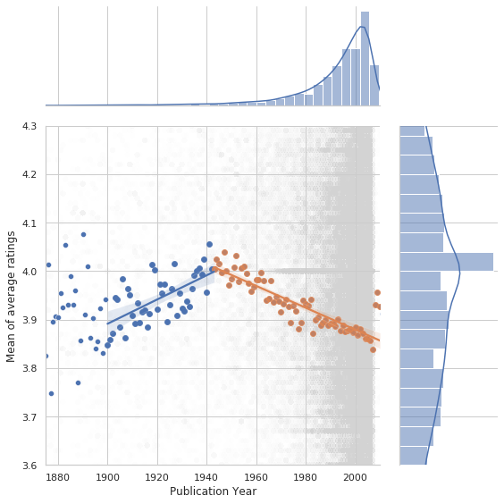
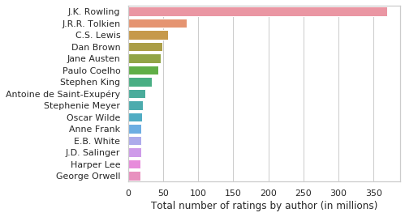
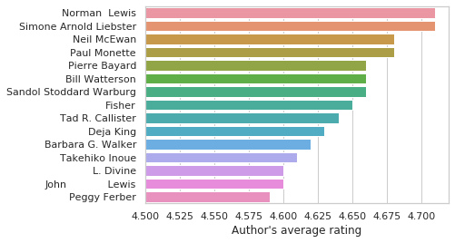
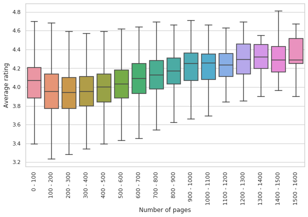
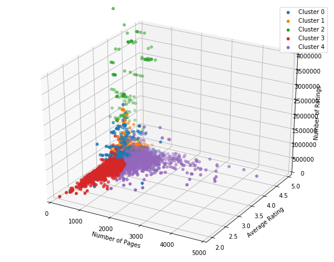
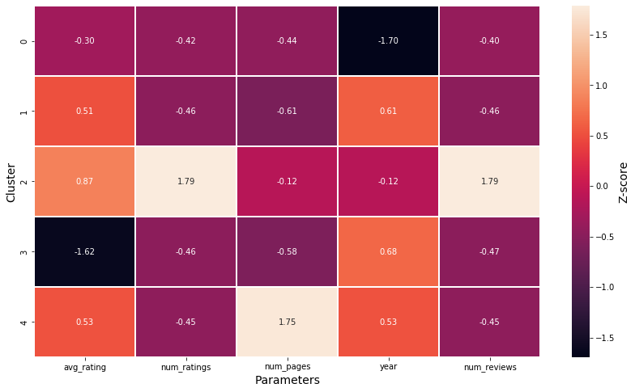

# Goodreads Book Analysis and recommender

## Project Goal

This repository hosts code for two main tasks:

1. Exploring and analyzing patterns within the Goodreads database, documented
   in the "Goodreads.ipynb" notebook.

2. Utilizing the insights gained from the database to generate personalized
   book recommendations, detailed in the "Book_recommender.ipynb" notebook.

These notebooks offer comprehensive exploration and recommendation
functionalities based on the Goodreads dataset

## Contents

1. [Exploratory Data Analysis](#eda)
    1. [Peak in Average Ratings between 1940 and 1950](#years)
    2. [Spotlight on Top Authors](#authors)
    3. [What parameters correlate with the best ratings?](#ratings-corr)
2. [Book Recommendation system](#rec-sys)
    1. [Cluster Analysis](#cluster)
    2. [Book recommender](#recommender)

Goodreads is social media hub designed for book enthusiasts,
offering a dedicated space for the sharing and evaluation of literary works.
Within its digital realm, a vast repository of books is meticulously cataloged,
featuring essential details such as titles, authors, publishers, as well as
insightful quotations and reviews contributed by the platform's active user
community.

The data used here has been scraped using a dedicated web scraper tool (see the
Goodreads_scraper repo).

## Exploratory Data Analysis <a id="eda"></a>

Within this notebook, we embark on a journey of cleaning and analyzing a vast
dataset comprising over 100,000 books. By delving into various parameters such
as average ratings, page counts, and publication dates, we unearth intriguing
relationships that shed light on the literary landscape. Here are some key
findings:

### Peak in Average Ratings between 1940 and 1950 <a id="years"></a>



Our analysis reveals a notable peak in average ratings for books published
during the 1940s and 1950s. Employing regression analysis, we observe two
distinct trends: one preceding circa 1945 (depicted in blue) and another
succeeding it (depicted in orange). The data suggests an increase in
average ratings up to this decade, followed by a consistent decline. Further
exploration
underscores a significant uptick in the number of ratings per book during this
period, affirming the heightened popularity of books from this era.

### Spotlight on Top Authors <a id="authors"></a>

Scrutinizing individual authors, we uncover a dichotomy between popularity and
rating averages. While some authors garner widespread acclaim based on the sheer
volume of ratings, others attain commendation through consistently high average
ratings. This juxtaposition underscores the multifaceted nature of literary
acclaim.





### What parameters correlate with the highest average ratings? <a id="ratings-corr"></a>

By investigating the relationships between different key parameters, we
demonstrate that the average rating of a book typically shows a positive
correlated with both the number of pages and the number of ratings/reviews.



## Book recommender <a id="rec-sys"></a>

In this notebook, our primary goal is to investigate how these parameters are
clustered by leveraging the K-Means algorithm and then use the K Nearest
Neighbours algorithm to develop a book recommendation system.

### Cluster Analysis (K-Means) <a id="cluster"></a>



We use the K-means algorithm to separate the books into clusters. K-Means is
an unsupervised machine learning technique, which partitions a dataset into 
distinct groups based on similarity, by minimizing the distances between points 
in a cluster. Together with the elbow method, which we use to select the
number of clusters, we separate the dataset into 5 clusters as shown below.



We also show a heatmap where each cell represents the mean value of the
parameter within the respective cluster. Values denote the Z-score, i.e. a
measure of how far the mean value of that cluster is from the average value
for all clusters. For example, we can see that the high Z-score in Cluster 4
in the num_pages column shows that this cluster represents books with the
most pages (purple in scatter plot above)

### Book recommender <a id="recommender"></a>
Once we have a better view of the distribution of books in our dataset, we 
can now proceed with the creation of the book recommender. This function 
asks the user for a book title (and optional author) and first uses 
CountVectorizer() to help identify the correct book in the database. Once 
this has been confirmed by the user it then uses the KNN algorithm to find 
books which are the most similar to the input and provides the user with the 
Top 5 book recommendations. I include a demonstration of the usage here:

First we run the recommender:
```
book_recommender()
```
The system prompts the user to enter a book title, in this case we input "A 
tale of two cities".
```
Please enter book name: A tale of two cities
```
We are then asked if we also want to include an author name.
```
Please enter author name (hit enter if unknown): 
```

The code now tries to find the correct book in the database. Asking the user 
yes or no until the correct book is found (or 10 books have been tried).

```
Closest title to 'A tale of two cities': A Tale of Two Cities by Ralph Mowat in English
Is this the book you want? (Yes/No): n

Closest title to 'A tale of two cities': A Tale of Two Cities by McDougal Littell in English
Is this the book you want? (Yes/No): n

Closest title to 'A tale of two cities': A Tale of Two Cities by Charles Dickens in English
Is this the book you want? (Yes/No): y
```
Once the book has been found, the recommender uses results from the 
pre-trained model to find the most similar books and returns the top 5.

```
5 Most Similar Books:
Great Expectations by Charles Dickens
Les Misérables by Victor Hugo
The Scarlet Letter (Bedford College Editions) by Ross C. Murfin
A Christmas Carol by Charles Dickens
Adventures of Huckleberry Finn by Mark Twain
```